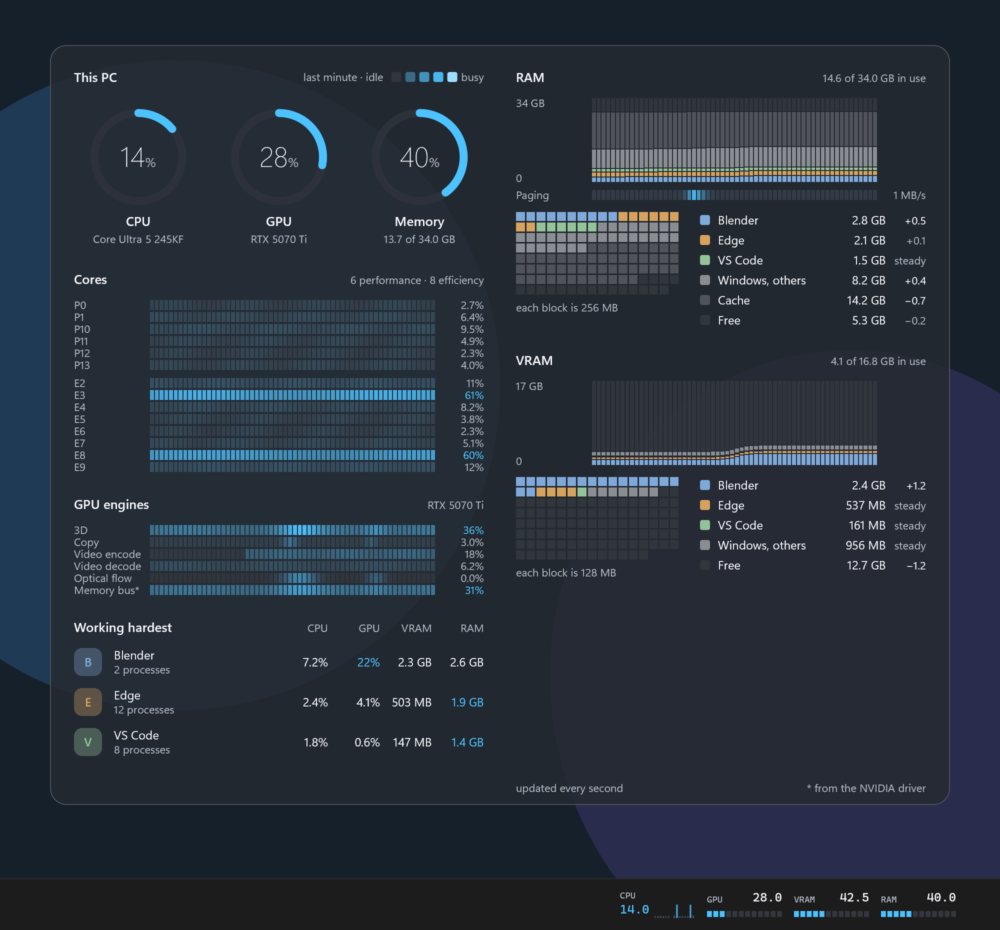
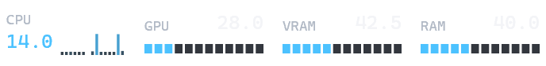

# Native Performance Monitor

A lightweight performance monitor for Windows 11 that lives on your desktop and
in your taskbar. It shows CPU cores, GPU engines, and who is holding your RAM
and VRAM, second by second, using about 0.15% of the processor.



*Sample data. The panel sits on the desktop below your windows; the strip sits
inside the taskbar.*

Native Win32 and Direct2D. No service, driver, browser engine, Explorer
add-in or network access.

## Download and run

1. Open
   [download/NativePerfMonitor-2.0.0-win-x64.zip](download/NativePerfMonitor-2.0.0-win-x64.zip)
   and press **Download raw file** (the download icon, top right).
2. Right-click the ZIP, choose **Extract All**, and extract it into a new
   folder. Everything it needs is inside; there is nothing else to install.
3. In that folder:
   - **Setup.exe** installs it for your Windows account: shortcuts, an entry in
     Installed apps, and it starts straight away. No administrator rights.
   - **PerfMonitor.exe** just runs it from where it is, changing nothing.
4. Windows will warn that the app is unsigned, because this is a local build:
   choose **More info › Run anyway**.
5. To remove it: **Uninstall.exe** in that folder, or Windows Settings ›
   Apps › Installed apps.

The panel appears on your desktop and the strip inside your taskbar. Right-click
the tray icon for everything else.

64-bit Windows 11. SHA-256 of the ZIP:
`f46bfbacc91b6dd484cf7a84ee0c4a445149f2842658d38aa52fd92854c5fc6c`

## What it shows

**Desktop panel**

| Section | What you see |
|---|---|
| Gauges | CPU, GPU and memory load right now, with the processor, graphics card and memory size underneath. |
| Cores | One row per physical core, performance cores first, one cell per sample. Colour is load: idle is dark, busy runs to your Windows accent colour. |
| GPU engines | The same heat rows for each kind of work the graphics card is doing: 3D, Copy, Video encode, Video decode, Optical flow (frame generation), JPEG decode. |
| RAM | Who held memory over time (the three busiest apps, Windows and other apps, cache, free), the same split right now as blocks, and each holder's change. A **Paging** row shows when Windows has to read memory back from disk. |
| VRAM | The same, for the graphics card's memory. |
| Working hardest | The three busiest apps with CPU, GPU, VRAM and RAM side by side. |

Every section shares one grid, so a moment in time lines up down the whole
panel. **History** switches everything between the last 60 seconds and the last
60 minutes. Wider than 860 pixels, the panel lays out in two columns.

**Taskbar strip**



CPU with one bar per core, then GPU, VRAM and RAM as meters. Inside the taskbar
it draws no background of its own, so it reads as part of the bar.

Both follow Windows light and dark mode; high contrast uses system colours.
Text and graphs stay fully opaque whatever the panel's background opacity.

## Light by design

Measured over two minutes with the panel and strip showing: **0.15% of total
CPU** (about 2% of one core) and **46 MB** of memory. The graphics card does no
work for it beyond Windows putting the window on screen.

- The screen is updated once a second and never animates.
- Everything that rarely changes is drawn once and reused; each second only
  the readings, gauge arcs and heat images are redrawn.
- Heat maps and memory bars are drawn as one image per section, not thousands
  of shapes.
- Nothing is drawn while the panel is hidden or a full-screen app is running.
- The NVIDIA **memory bus** row is off by default: the library behind it costs
  about 20 MB. Turn it on from the tray menu if you want it.

## Where it puts things

| | |
|---|---|
| Installed files | `%LOCALAPPDATA%\Programs\NativePerfMonitor-2.0` |
| Settings | `%LOCALAPPDATA%\NativePerfMonitor-2.0` (one small text file) |
| Startup (optional) | a `NativePerfMonitor-2.0` value under the current user's Run key |

Each version installs side by side with earlier ones and brings their settings
across on first run, so an older copy keeps working until you remove it.
Removal only touches files and entries that this version created.

## Using it

Right-click the tray icon (it may be in the overflow area).

| Menu item | Does |
|---|---|
| Desktop panel / Taskbar strip | Show or hide each surface. |
| Lock panel | Locked, the panel is click-through and stays in the desktop layer. Unlock to move or resize it. |
| Prefer inside taskbar | Fit the strip into free taskbar space; otherwise it sits just above the taskbar. |
| Panel opacity… | Background opacity from 10% to 100%. |
| Size, Reset positions | Preset panel sizes; put both surfaces back where they started. |
| GPU | Which graphics card to monitor. |
| History | 60 seconds or 60 minutes. |
| NVIDIA memory bus | The optional memory bus row (NVIDIA cards). |
| Start with Windows, Pause monitoring | As named. |
| Record placement trace | Writes a log of window placement for bug reports. |

## What the numbers mean

- **CPU** is busy time from Windows' idle counters; it can differ slightly from
  Task Manager, which adjusts for clock speed.
- **GPU** is the busiest engine on the selected card. **VRAM** is dedicated
  memory only.
- **App RAM** is each app's private working set; memory apps share is counted
  under "Windows, others". **Cache** is memory Windows hands back the moment an
  app needs it.
- **Paging** is data read back from disk to satisfy memory, in MB per second.
- GB and MB are decimal: 1 GB = 1,000,000,000 bytes.

## Privacy

The monitor reads Windows performance counters and nothing else. It never
connects to the network, has no telemetry, needs no administrator rights and
installs no service or driver. Settings are one small local file.

## Build from source

Needs Visual Studio 2022 with *Desktop development with C++*, a Windows 11 SDK
and CMake 3.24 or later. No third-party packages.

```powershell
.\scripts\Build.ps1          # configure, build and run every test
.\scripts\CreatePackage.ps1  # the ready-to-run folder and ZIP in release\
```

Or with CMake directly:

```powershell
cmake -S . -B build -G "Visual Studio 17 2022" -A x64
cmake --build build --config Release
ctest --test-dir build -C Release --output-on-failure
```

The tests cover the calculations, rendering at 100–200% scaling, real window
behaviour on the desktop and taskbar, installation, and guarded removal. Window
tests need an interactive desktop and refuse to run while a copy of the monitor
is open. `PerfMonitor.exe --render-preview <folder>` renders every theme,
layout and range from sample data, which is how the figures above are made.

## Versions

Versions follow `major.minor.patch`, and every release is a git tag. The
[changelog](CHANGELOG.md) lists each version's changes under **Added**,
**Changed**, **Fixed** and **Removed**. The current release is **2.0.0**.

## Documentation

- [Architecture](docs/architecture.md): threads, data flow, the two surfaces
- [Placement](docs/placement.md): how the panel and strip stay put; read this
  before changing window code
- [Rendering](docs/rendering.md): drawing, transparency, the grid, drawing cost
- [Troubleshooting](docs/troubleshooting.md)
- [Repository layout](docs/repository-layout.md)

## License

[MIT](LICENSE.txt)

## Packaging a release

`scripts/CreatePackage.ps1` writes the ready-to-run folder and ZIP into
`release/`. Copy that ZIP into `download/`, update the link and the SHA-256 in
this README, commit, and tag the commit `vX.Y.Z`. Only the current version is
kept in `download/`; earlier ones stay on this machine, outside the
repository.
